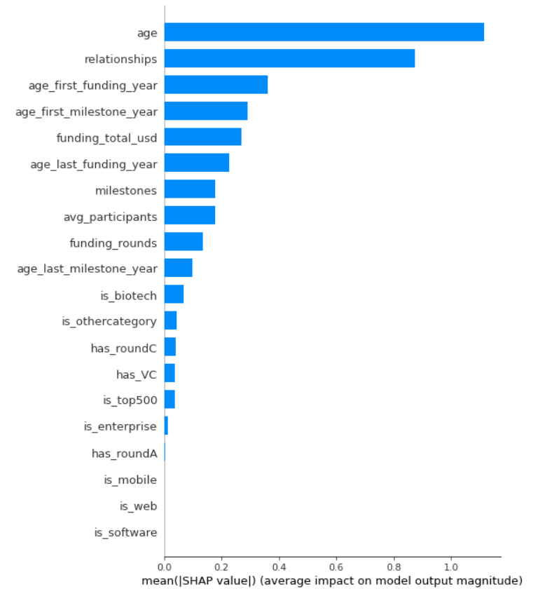

# Startup success prediction
> In this project, we wanted to create a model that will predict the success rate of a startup based on multiple input parameters.

## Table of Contents
* [Data exploration](#data-exploration)
* [Results](#results)
* [Shapely results](#shapely-results)
* [App on Heroku](#app-on-heroku)
* [Contact](#contact)

## Data exploration
Source of the data used in this project is a dataset from Kaggle that can be found here:
https://www.kaggle.com/datasets/manishkc06/startup-success-prediction

After initial data exploration and preparation we established a list of important parameters:

| Number | Name                     | Type       | Description                                                                                                                        |
|--------|--------------------------|------------|------------------------------------------------------------------------------------------------------------------------------------|
| 1      | age                      | float      | Amount of years from founded year up to the year of closing (or 2013 as a maximum).                                                |
| 2      | age_first_funding_year   | float      | Age of the company when the it received first funding.                                                                             |
| 3      | age_last_funding_year    | float      | Age of the company when the it received last funding.                                                                              |
| 4      | age_first_milestone_year | float      | Age of the company in years when it reached first milestone.                                                                       |
| 5      | age_last_milestone_year  | float      | Age of the company in years when it reached last milestone.                                                                        |
| 6      | relationships            | int        | Amount of relations with others like accountants, investors, vendors, mentors etc.                                                 |
| 7      | funding_rounds           | int        | How many times was the funding money transferred.                                                                                  |
| 8      | funding_total_usd        | int        | Total amount of money provided to the company through funding (in US dollars)                                                      |
| 9      | milestones               | int        | How many milestones was set up for the startup.                                                                                    |
| 10     | is_software              | int(0/1)   | True/False parameter for the company being from 'software' category.                                                               |
| 11     | is_web                   | int(0/1)   | True/False parameter for the company being from 'web' category.                                                                    |
| 12     | is_mobile                | int(0/1)   | True/False parameter for the company being from 'mobile' category.                                                                 |
| 13     | is_enterprise            | int(0/1)   | True/False parameter for the company being from 'enterprise' category.                                                             |
| 14     | is_advertising           | int(0/1)   | True/False parameter for the company being from 'advertising' category.                                                            |
| 15     | is_gamesvideo            | int(0/1)   | True/False parameter for the company being from 'gamesvideo' category.                                                             |
| 16     | is_ecommerce             | int(0/1)   | True/False parameter for the company being from 'ecommerce' category.                                                              |
| 17     | is_biotech               | int(0/1)   | True/False parameter for the company being from 'biotech' category.                                                                |
| 18     | is_consulting            | int(0/1)   | True/False parameter for the company being from 'consulting' category.                                                             |
| 19     | is_othercategory         | int(0/1)   | True/False parameter for the company being in any category other than the ones mentioned above.                                    |
| 20     | has_VC                   | int(0/1)   | Determines if the company had Venture capital fund provided.                                                                       |
| 21     | has_angel                | int(0/1)   | Determines if the company had a guardian angel overseer to support their endeavours.                                               |
| 22     | has_roundA               | int(0/1)   | Parameter stating if company has reached round A level in funding.                                                                 |
| 23     | has_roundB               | int(0/1)   | Parameter stating if company has reached round B level in funding.                                                                 |
| 24     | has_roundC               | int(0/1)   | Parameter stating if company has reached round C level in funding.                                                                 |
| 25     | has_roundD               | int(0/1)   | Series D funding is the fourth stage of fundraising that a business reaches after the seed stage and all rounds of A-C completion. |
| 26     | avg_participants         | float      | Average amount of people involved in the startup throughout in the time of it running.                                             |
| 27     | is_top500                | int(0/1)   | Determines if the company has ever reached the Top 500 companies ranking.                                                          |

These columns have been included into our **X dataset**.

As for our target, we've established a column named '_labels_' will be sufficient. This column represents the same values (just in boolean
form instead of string) like column '_status_' of the dataset, which consists of values '**closed**' and '**acquired**'. If a startup was acquired, it means it was so successfull
that it was bought. That is our target of success then - based on the dataset, we have 65% startups acquired and the rest of them have been closed. 

| Number | Name    | Type      | Description                                                     |
|--------|---------|-----------|-----------------------------------------------------------------|
| 1      | labels  | int(0/1)  | True/False parameter for the company being acquired or closed.  |

This column has been included into our **y dataset**.

## Results

From different iterations of passing the data through different models, we established that the best 2 are: 

**RandomForestClassifier**, with results:  
Best parameters: {'max_depth': 12, 'min_samples_leaf': 2, 'min_samples_split': 12, 'n_estimators': 150}  
F1 score: 0.88  
Accuracy: 0.83  
Precision: 0.84  
Recall: 0.918

and **XGBoostClassifier**, with results:  
F1 score: 0.87  
Accuracy: 0.83  
Precision: 0.85  
Recall: 0.900

## Shapely results
The reason why we chose **not** to pick only 1 model is that both of them have results we are satisfied with and when using Shapely values, we established that 
there are little differences of the same parameters influencing those decent results:

| Random Forest                       | XG Boost                           |
|-------------------------------------|------------------------------------|
|   |  |

This is our first attempt at a Data Science project. We wish to expand our knowledge and improve the approach to our work.
In the future, we are planning to change the dataset to be based on Polish companies and to provide a dashboard, 
that will show different plots, graphs and the possibility to interact with the model as it is now via the console. 

## App on Heroku
Both models results are saved using Pickle and this allowed us to create an efficient dashboard for Heroku app deployment.
You can try out how would your business succeed (or fail) here:   

https://startup-prediction-project.herokuapp.com

## Contact
If you would like to provide us with good or constructive feedback - please do so :)
You can reach us at **kamil.bukalski@provosolutions.pl** or **gornykml@gmail.com**.

